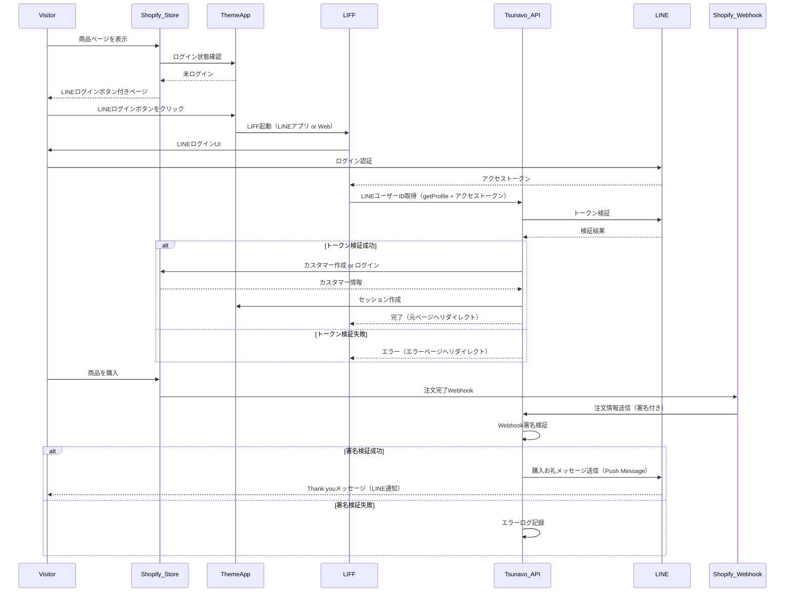

# データシーケンス図

```mermaid
sequenceDiagram
    participant Visitor
    participant Shopify_Store
    participant ThemeApp
    participant LIFF
    participant Tsunavo_API
    participant LINE
    participant Shopify_Webhook

    Visitor->>Shopify_Store: 商品ページを表示
    Shopify_Store->>ThemeApp: ログイン状態確認
    ThemeApp-->>Shopify_Store: 未ログイン
    Shopify_Store-->>Visitor: LINEログインボタン付きページ

    Visitor->>ThemeApp: LINEログインボタンをクリック
    ThemeApp->>LIFF: LIFF起動（LINEアプリ or Web）

    LIFF->>Visitor: LINEログインUI
    Visitor->>LINE: ログイン認証
    LINE-->>LIFF: アクセストークン

    LIFF->>Tsunavo_API: LINEユーザーID取得（getProfile + アクセストークン）
    Tsunavo_API->>LINE: トークン検証
    LINE-->>Tsunavo_API: 検証結果

    alt トークン検証成功
        Tsunavo_API->>Shopify_Store: カスタマー作成 or ログイン
        Shopify_Store-->>Tsunavo_API: カスタマー情報
        Tsunavo_API->>ThemeApp: セッション作成
        Tsunavo_API-->>LIFF: 完了（元ページへリダイレクト）
    else トークン検証失敗
        Tsunavo_API-->>LIFF: エラー（エラーページへリダイレクト）
    end

    Visitor->>Shopify_Store: 商品を購入
    Shopify_Store->>Shopify_Webhook: 注文完了Webhook

    Shopify_Webhook->>Tsunavo_API: 注文情報送信（署名付き）
    Tsunavo_API->>Tsunavo_API: Webhook署名検証

    alt 署名検証成功
        Tsunavo_API->>LINE: 購入お礼メッセージ送信（Push Message）
        LINE-->>Visitor: Thank youメッセージ（LINE通知）
    else 署名検証失敗
        Tsunavo_API->>Tsunavo_API: エラーログ記録
    end
``` 